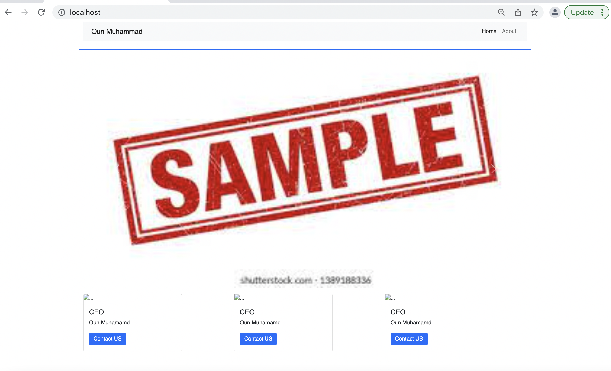

# webproject
# Docker Nginx Flask Project Setup
# Created main branch and webpagesetup branch

Just Run:

docker compose up -- build to get it to run and go to localhost

## Screenshot of Running Program

